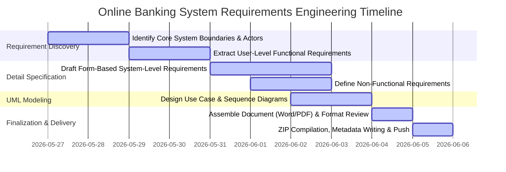

# 🗺️ Roadmap: Systems Analysis & Design Project (Phase 1)
## 🏦 Case Study: Online Banking System (OBS)

This roadmap outlines the complete strategy, methodology, and step-by-step checklist to deliver an outstanding, premium-grade requirements engineering specification for the **Online Banking System** case study. 

The structure is meticulously crafted to incorporate the requirements engineering rules from the course slides (natural language, form-based tables, and graphical UML notations) and meets all deadlines and formatting standards specified in @[plan.md].

---

## 📅 Critical Timeline & Milestones
The deadline for Phase 1 submission is **Friday, Khordad 8, 1405 (June 5, 2026), at 24:00**. 



---

## 🛠️ Step-by-Step Implementation Plan

### 📍 Step 1: System Scope & Boundaries Definition (May 27 – May 28)
Determine the exact functional domains and user personas involved in the Online Banking System.
*   **Target Core Modules:**
    1. **Authentication & Security:** Secure registration, MFA, bio-metrics, session timeouts.
    2. **Account Management:** Checking/savings dashboard, balance inquiries, interest calculation.
    3. **Fund Transfers:** Internal (intra-bank), external (ACH/wire transfer), and scheduled recurring payments.
    4. **Transaction Logs:** Real-time ledger, search/filter history, PDF/CSV statement exports.
    5. **Bill Payments & Utility Integration:** Utility biller registration and automated payments.
*   **System Actors:**
    *   *Primary Actors:* Individual Customer, Corporate Customer.
    *   *Secondary/Supporting Actors:* System Administrator, Bank Operator/Teller, Third-Party Payment Processor, Core Banking Database Server.

---

### 📍 Step 2: Formulate User-Level Requirements (May 29 – May 30)
Define requirements from the user's perspective, using **numbered natural language sentences** as specified in the course slides.
*   **Goal:** Express "what" the system must do without prescribing how it is technically implemented.
*   **Structure:**
    *   **Functional (User-Level):** e.g., `OBS-UFR-1.0`: "A customer shall be able to transfer money from their checking account to another domestic bank account."
    *   **Non-Functional (User-Level):** e.g., `OBS-UNFR-1.0`: "The system must ensure that all financial data is kept private and secure against unauthorized viewing."

---

### 📍 Step 3: Specify System-Level Requirements using Form-Based Specification (May 31 – June 2)
Convert the high-level user requirements into precise, technical **System Requirements**. Following the course instructions for **Structured Natural Language / Form-Based Specifications**, each functional requirement will be fully defined inside an explicit structured table.

> [!IMPORTANT]
> **Form-Based Specification Schema to be Used (As per course slides):**
> 
> | Field | Description / Content |
> | :--- | :--- |
> | **Requirement ID** | Unique system-level code (e.g., `OBS-SRS-FR-03.02`) |
> | **Function / Entity** | Definition of the function, component, or system entity |
> | **Description** | Detailed explanation of what the system function accomplishes |
> | **Inputs** | Specific input values, variables, or data fields |
> | **Source** | Origin of inputs (e.g., customer UI form, database query, session token) |
> | **Outputs** | Specific output values, visual indicators, or response data |
> | **Destination** | Destination of outputs (e.g., transaction database, user screen, webhooks) |
> | **Action to be Taken** | Step-by-step sequential processing logic and computation steps |
> | **Pre-conditions** | Required state of the system before executing the function |
> | **Post-conditions** | State of the system after successful execution |
> | **Side Effects** | Collateral impacts (e.g., sending notification SMS, invalidating cached tables) |

---

### 📍 Step 4: Refine Non-Functional Requirements (NFRs) (June 1 – June 2)
Specify non-functional user requirements into quantitative and testable system-level constraints.
*   **Performance (Speed & Latency):** Maximum response times (e.g., transaction verification under 2 seconds), concurrent user handling capability.
*   **Security (Confidentiality & Integrity):** Strict requirements for TLS 1.3, AES-256 database encryption, tokenized API sessions, hashing algorithms (SHA-256) for passwords.
*   **Reliability & Availability:** Uptime SLAs (e.g., 99.99% availability), disaster recovery time objectives (RTO < 30 minutes).
*   **Usability:** Mobile responsiveness, accessibility compliance (WCAG 2.1).

---

### 📍 Step 5: Design UML Graphical Notations (June 2 – June 3)
As marked in the course slides under **Graphical Notations**, we must include visual representations for the functional side of the system.
*   **UML Use Case Diagram:** 
    *   Map out all main system boundary actions.
    *   Highlight links between Actors (Customers, Administrators, Gateway APIs) and Use Cases (Login, Transfer Funds, Generate Statement).
*   **UML Sequence Diagrams:** 
    *   Map out complex functional workflows showing chronological message passing.
    *   *Key Sequence Flows to Model:* 
        1. Multi-Factor Authentication & Access Grant.
        2. Domestic Fund Transfer (Debit, Credit, Ledger updates, and external API clearance).
        3. Generating secure PDF statements.

---

### 📍 Step 6: Review, Assembly, and Formatting (June 4 – June 5)
Prepare the final document for submission.
1.  **Drafting:** Combine all sections (Introduction, Scope, User Requirements, Structured System-Level Tables, NFRs, UML diagrams) in a professional Word / PDF template.
2.  **Visual Styling:** Ensure clean table styles, clear heading hierarchies (H1 $\rightarrow$ H2 $\rightarrow$ H3), readable font pairings, and well-rendered UML vector graphics.
3.  **Cross-Referencing:** Ensure every User Requirement successfully maps to a specific System Requirement ID.

---

## 📦 Submission & Delivery Workflow
All course instructions regarding deliverables must be strictly adhered to:

> [!WARNING]
> **Delivery Constraint Checklist:**
> *   [ ] **Format:** Electronic format ONLY (Word or PDF file). No raw markdown or text-only submissions.
> *   [ ] **Packaging:** Place the document inside a directory and compress it into a **ZIP** file.
> *   [ ] **English Requirement:** The entire document and description must be in English.
> *   [ ] **Descriptive Text:** When uploading the ZIP file, include the exact descriptive string beside the file in the following format:
>     ```text
>     [First name], [Last name], [Student ID], SAD, Online Banking System, phase 1
>     ```
>     *Example:* `Ali Reza Kavianifar, <Student_ID>, SAD, Online Banking System, phase 1`

---

## 🚀 Execution Checklist for Agent & Student

- [ ] **Task 1:** Draft high-level system boundary document specifying actors and main modules.
- [ ] **Task 2:** Write down the numbered natural language Functional & Non-Functional User Requirements.
- [ ] **Task 3:** Select the top 5 core system-level transactions and build their complete form-based specification tables.
- [ ] **Task 4:** Create the quantitative system-level Non-Functional Requirements.
- [ ] **Task 5:** Render the UML Use Case Diagram and Sequence Diagrams using Mermaid / PlantUML.
- [ ] **Task 6:** Create the formatted Word/PDF deliverable and package it into a ZIP archive.
- [ ] **Task 7:** Draft the final submission message with the student ID format.
